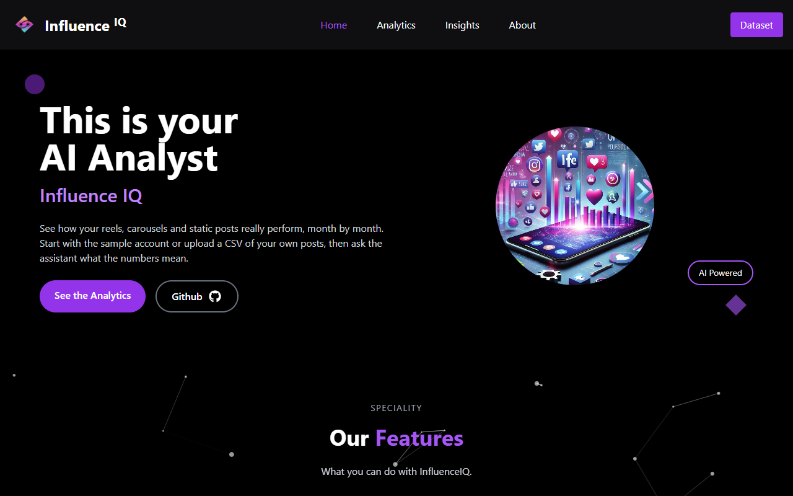
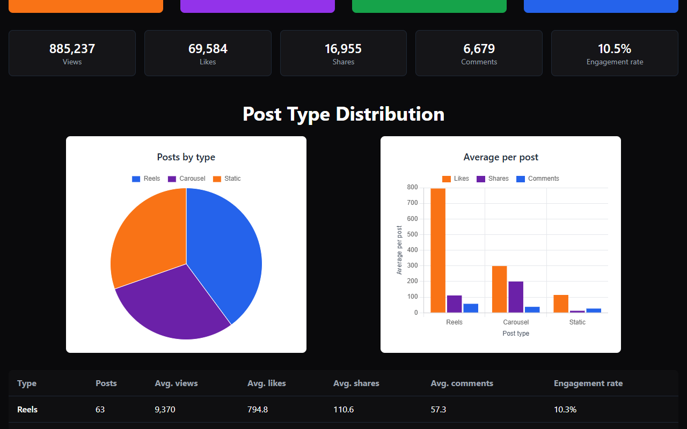
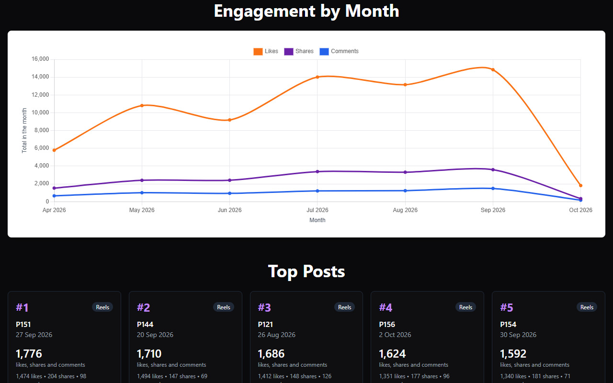
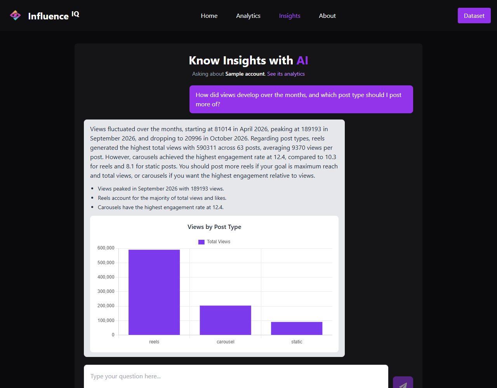

# InfluenceIQ

InfluenceIQ shows how the posts of a social media account perform, and answers
questions about them. Open it and you see the analytics of a sample account;
upload a CSV of your own posts and you see the same for them.

**Live demo:** <https://influenceiq-s.vercel.app>
(the first request after a quiet spell can take up to a minute, while the
server wakes up)

We started it as a personal project in January 2025 and completed it
afterwards. [docs/design.md](docs/design.md) describes the design.

## Screenshots

| | |
|---|---|
|  |  |
|  |  |

## What it does

- **Analytics**: totals, figures for each post type (reels, carousel, static),
  averages per post, engagement rates, engagement month by month, the five
  best posts, and a table of every post that sorts and pages.
- **Insights**: a conversation about the dataset on screen. An answer has
  text, key points and, when it helps, a chart.
- **Your own data**: upload a CSV file without signing up. Rows that cannot be
  read are skipped and reported by line number.
- **No accounts**: an upload gets a long random id that only your browser
  knows. It is deleted after 7 days, and you can remove it earlier. You can
  switch between your upload and the sample at any time.

## How it changed since the first version

The first version read its posts from an Astra DB database and got its
answers from a flow on DataStax's hosted Langflow service. That service was
shut down in April 2026, and free Astra databases are paused and later deleted
when nobody uses them. The completed version keeps the same idea and pages,
with its own server: MongoDB holds the posts, the server calculates the
figures, and Google Gemini answers the questions.

## CSV format

One row for each post, with a header row. Columns can come in any order.

| Column | Required | Value |
|---|---|---|
| `post_type` | yes | `reels`, `carousel` or `static` |
| `date_posted` | yes | A day written like `2026-03-15` |
| `likes`, `shares`, `comments` | yes | Whole numbers, 0 or more |
| `views` | no | Whole number, 0 or more; 0 when missing |
| `post_id` | no | Any text; numbered when missing |

```csv
post_type,date_posted,likes,shares,comments,views
reels,2026-03-15,120,30,12,4000
static,2026-03-16,40,2,5,900
```

A file can have up to 2,000 rows and 1 MB. The sample dataset can be
downloaded from the Analytics page as an example.

## Tech stack

| Part | Stack |
|---|---|
| Frontend | React 18, Vite, Tailwind CSS, Chart.js |
| Backend | Node.js, Express, MongoDB with Mongoose, Multer, Google Gemini |
| Tests | Jest, Supertest, in-memory MongoDB |

## Getting started

### Prerequisites

- Node.js 20 or newer
- A MongoDB connection string (local MongoDB or MongoDB Atlas)
- Optional: a Google Gemini API key, for the Insights page

### Setup

```bash
cd backend
npm install
cp .env.example .env     # then fill in the values, see below

cd ../frontend
npm install
```

### Settings

`backend/.env`:

| Key | Purpose |
|---|---|
| `MONGODB_URI` | Database connection string |
| `PORT`, `SERVER_HOST` | Where the server listens (`3003`, `localhost`). On a host, `SERVER_HOST` is `0.0.0.0` and the host sets `PORT` |
| `CORS_ORIGIN` | Optional. Another origin that may call the server from a browser. The web app itself needs none: it reaches the server through its own address |
| `GEMINI_API_KEY` | Optional. Without it the analytics work and the Insights page says the assistant is not set up |
| `GEMINI_MODEL` | Optional. Defaults to `gemini-3.5-flash-lite` |
| `DAILY_QUESTION_LIMIT` | Optional. Questions per visitor per day, default `20` |
| `SITE_QUESTION_LIMIT` | Optional. Questions for the whole site per day, default `300` |
| `UPLOAD_RATE_LIMIT` | Optional. Uploads per visitor per hour, default `10` |
| `CONNECTION_IP_HEADER` | Optional. A header in which the host reports the caller's address and which a caller cannot set, for example `cf-connecting-ip` on Render. Needed only where the host's own proxies sit in front of the server |

The web app needs no settings.

### Run

Start the server and the web app in two terminals:

```bash
cd backend
npm run dev
```

```bash
cd frontend
npm run dev
```

Open <http://localhost:5177>. The web app forwards `/api` to the server on
port 3003. The sample dataset is built when the server starts.

### Tests

```bash
cd backend
npm test
```

The tests start their own in-memory database and never call Gemini.

## How the assistant is kept in check

- It is given the calculated figures of the dataset, not the table of posts.
- What a visitor types (the question, the conversation, the name of their
  file) is passed as data, apart from the instructions.
- Its answer must fit a fixed shape. A chart that cannot be drawn is dropped;
  the text is still shown.
- A question does not count against the daily limit when the assistant could
  not be reached.
- The limits are kept for each visitor and, more widely, for the address a
  request really came from, so they cannot be reset by pretending to be
  someone else.
- The key stays on the server.

## Deployment

The server and the web app are deployed separately.

- **Server**: any Node.js host. Set the settings above, with
  `SERVER_HOST=0.0.0.0`. The start command is `npm start` in `backend`.
  On Render, also set `CONNECTION_IP_HEADER=cf-connecting-ip`.
- **Web app**: a static build of `frontend` (`npm run build`).
  `frontend/vercel.json` forwards `/api` to the server; put the server's
  address there.

## API

Every route is under `/api/v1` and answers
`{ statusCode, data, message, success }`. A dataset id is `sample` or the id
an upload returned.

| Route | Purpose |
|---|---|
| `GET /health` | The server is up |
| `GET /datasets/sample.csv` | The sample dataset as a CSV file |
| `POST /datasets` | Upload a CSV (form field `file`) |
| `GET /datasets/:id/analytics` | The figures and posts of a dataset |
| `DELETE /datasets/:id` | Remove an upload |
| `POST /datasets/:id/questions` | Ask a question: `{ question, history }` |

## Project structure

```
backend/
  src/
    app.js, index.js    Express app and start-up
    analysis/           Reading a CSV, calculating the figures, the sample dataset
    assistant/          The Gemini call, what is sent, checking what comes back
    controllers/        Datasets and questions
    middlewares/        Upload and request limits
    models/             Dataset, Usage
    routes/, utils/
  tests/
frontend/
  src/
    api/                Requests to the server
    components/         Charts, table, upload dialog, shared pieces
    lib/                The remembered dataset, formatting, chart setup
    pages/              Home, Analytics, Insights, About
docs/
  design.md             Design of the app
```

## Team

Built by team Hack Horizon: Samir Suroshe
([@samirsuroshe18](https://github.com/samirsuroshe18)), Tanishq Kulkarni
([@tanishqbuilds](https://github.com/tanishqbuilds)), Mohit Dhangar
([@mohit45v](https://github.com/mohit45v)) and Pranay Sanap
([@pranaysanap](https://github.com/pranaysanap)).

## License

[MIT](LICENSE)
